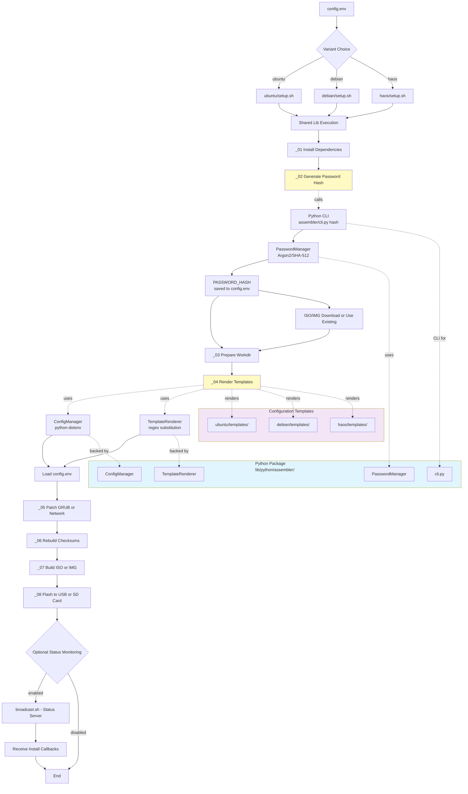
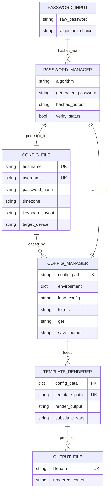

# Automated Linux ISO Builder

[](https://github.com/josephmienko/acephalous-assembler/actions/workflows/validate.yml)
[](https://github.com/josephmienko/acephalous-assembler/actions/workflows/coverage.yml)
[](https://github.com/josephmienko/acephalous-assembler/actions/workflows/status.yml)

This bundle builds custom Linux ISOs and disk images with automated installation capabilities:

- **Ubuntu** — autoinstall with optional NoCloud live-installer credentials
- **Debian** — preseed-based automated installation (experimental)
- **Home Assistant OS** — Raspberry Pi 5 headless deployment (experimental)

All variants:

- Extract and customize official distributor ISO images
- Inject installer configuration (autoinstall.yaml or preseed.cfg)
- Patch bootloader for unattended boot-to-install
- Flash to USB via native macOS `dd` command
- Support optional status server for installation monitoring

## Select Your Distribution

Choose your preferred workflow:

**Ubuntu (recommended):** Standard autoinstall flow with cloud-init integration

```bash
./setup.sh
./build_and_flash.sh
```

**Debian (experimental):**  Preseed-based Debian Installer flow

```bash
./setup.sh debian
./build_and_flash.sh
```

**Home Assistant OS (experimental):** Raspberry Pi 5 headless deployment

```bash
./setup.sh haos
./build_and_flash.sh
```

## Ubuntu Workflow Details

This section describes the Ubuntu variant.

### 1) Initialize & configure

```bash
cd ~/Downloads
unzip acephalous-assembler.zip -d acephalous-assembler
cd acephalous-assembler
./setup.sh
```

This script will:

- Generate a SHA-512 password hash and update `config.env` if missing
- Persist whether NoCloud live-installer credentials should be included in the
  next build

At minimum, configure these in `config.env`:

- `ISO` — path to Ubuntu Server ISO
- `OUT` — output path for the custom ISO
- `HOSTNAME` — installed system hostname
- `USERNAME` — installed system username
- `PASSWORD_HASH` — SHA-512 password hash (generated by `setup.sh`)
- `STATUS_IP` — local IP for receiving install callbacks
- `STATUS_PORT` — port for the status server (default `8081`)
- `FLASH_DRIVE` — USB drive device path (for example `/dev/disk2`)

### 2) Optional NoCloud live-installer credentials flag

`setup.sh` accepts an optional flag that controls whether a NoCloud seed should
be added for the temporary installer environment:

```bash
./setup.sh --include-nocloud-installer-credentials
```

This is equivalent to:

```bash
./setup.sh --include-nocloud-installer-credentials=true
```

To force the default normal mode explicitly:

```bash
./setup.sh --include-nocloud-installer-credentials=false
```

If the flag is omitted, the bundle writes:

```bash
INCLUDE_NOCLOUD_INSTALLER_CREDENTIALS="false"
```

into `config.env`, and the next build uses the standard working autoinstall ISO
without the extra NoCloud seed.

When the flag is enabled:

- the ISO still contains the normal working `/autoinstall.yaml`
- the ISO also contains a NoCloud seed under `/nocloud/`
- the temporary live installer user is controlled by:
  - `LIVE_INSTALLER_USER` (default `installer`)
  - `PASSWORD_HASH`
  - `LIVE_INSTALLER_HOSTNAME`

That lets you SSH into the live installer environment with the same password you
used to generate `PASSWORD_HASH`, while still preserving the normal autoinstall
flow.

### 3) Build & flash the ISO

```bash
./build_and_flash.sh
```

This script will:

- Extract the Ubuntu ISO into a writable work tree
- Render `/autoinstall.yaml` from the template using your config
- Optionally render `/nocloud/user-data` and `/nocloud/meta-data`
- Patch GRUB to add `autoinstall`, and optionally the NoCloud datasource path
- Rebuild the ISO with modified files and checksums
- Flash the ISO to the configured USB drive using `dd`
- Eject the USB drive safely on success

### 4) Optional: monitor the installation

In a separate terminal, start the status listener:

```bash
./broadcast.sh
```

This opens a local status page showing webhook callbacks from the installer and
the first-boot callback from the installed target system.

## Implementation

The implementation scripts are organized in `lib/`:

- `lib/_01-install-deps.sh` — install Homebrew dependencies
- `lib/_02-generate-password-hash.sh` — generate and persist `PASSWORD_HASH`
- `lib/_03-prepare-workdir.sh` — extract the Ubuntu ISO into a writable work tree
- `lib/_04-render-template.py` — render a template file using values from `config.env`
- `lib/_05-patch-grub.py` — add `autoinstall` and optionally the NoCloud datasource path
- `lib/_06-rebuild-md5.py` — rebuild `md5sum.txt`
- `lib/_07-build-iso.sh` — repack the modified ISO
- `lib/_08-flash-image.sh` — flash the rebuilt ISO to the configured USB drive and eject it
- `lib/_991-start-status-server.sh` — wrapper to launch the status server
- `lib/_992-install-status-server.py` — receive install-status and first-boot callbacks

## Templates

- `templates/autoinstall.template.yaml` — normal installed-system autoinstall template
- `templates/nocloud-user-data.template.yaml` — optional live-installer cloud-init seed
- `templates/nocloud-meta-data.template` — optional NoCloud meta-data

## Architecture

### Build Pipeline Flowchart

Visualizes the 8-step shared build process and how the three OS variants feed into it:



**Source:** [`lib/python/assembler/architecture-flowchart.mmd`](lib/python/assembler/architecture-flowchart.mmd)

### Data Flow & Entity Relationships

Shows how configuration data and passwords flow through the Python classes:

<div style="width: 100%; max-width: 900px; margin: 0 auto;">



**Source:** [`lib/python/assembler/erDiagram.mmd`](lib/python/assembler/erDiagram.mmd)

## Notes

- This workflow wipes the selected target disk and installs Ubuntu fresh.
- The template is configured to reboot after install and send a first-boot callback.
- The NoCloud option is only for gaining SSH access to the temporary installer environment.
- The installed system credentials still come from the normal autoinstall `identity` block.

## CI/CD & Quality

Automated checks run on every push and pull request:

### Workflows

- **Validation** — ShellCheck linting, project structure validation, automated tests
- **Coverage** — Test coverage analysis and results reporting
- **Status** — Python syntax validation, YAML format validation

### Badges

| Badge | Workflow | Purpose |
| --- | --- | --- |
| [](https://github.com/yourusername/ubuntu_install_status_bundle/actions/workflows/validate.yml) | Validation | Shell script linting, file structure, tests |
| [](https://github.com/yourusername/ubuntu_install_status_bundle/actions/workflows/coverage.yml) | Coverage | Test coverage percentage and reports |
| [](https://github.com/yourusername/ubuntu_install_status_bundle/actions/workflows/status.yml) | Status | Python and YAML validation |

### Running Tests Locally

Execute automated tests:

```bash
./tests/run-all-tests.sh
```

Full test suite includes:

- Unit tests for shared config functions
- Integration tests for variant setup
- 12+ passing validations

## Development

This project uses **Poetry** for Python dependency management.

### Quick Start

```bash
poetry install      # Install dependencies
poetry shell        # Activate virtual environment
pytest              # Run tests
```

See [POETRY_QUICKSTART.md](POETRY_QUICKSTART.md) for quick setup, or [DEVELOPMENT.md](DEVELOPMENT.md) for full details.

### Python Modules

Core utilities in `lib/python/assembler/`:

- **ConfigManager** — Load and manage .env-style configuration
- **PasswordManager** — Generate and hash passwords (Argon2, SHA-512)
- **TemplateRenderer** — Render templates with variable substitution

### Password Hashing

This project uses **Argon2** (modern best-practice) for password hashing, with fallback to SHA-512 for Debian preseed compatibility.

- **Argon2**: GPU-resistant, configurable, recommended for new deployments
- **SHA-512**: Legacy support for Debian preseed on older systems
